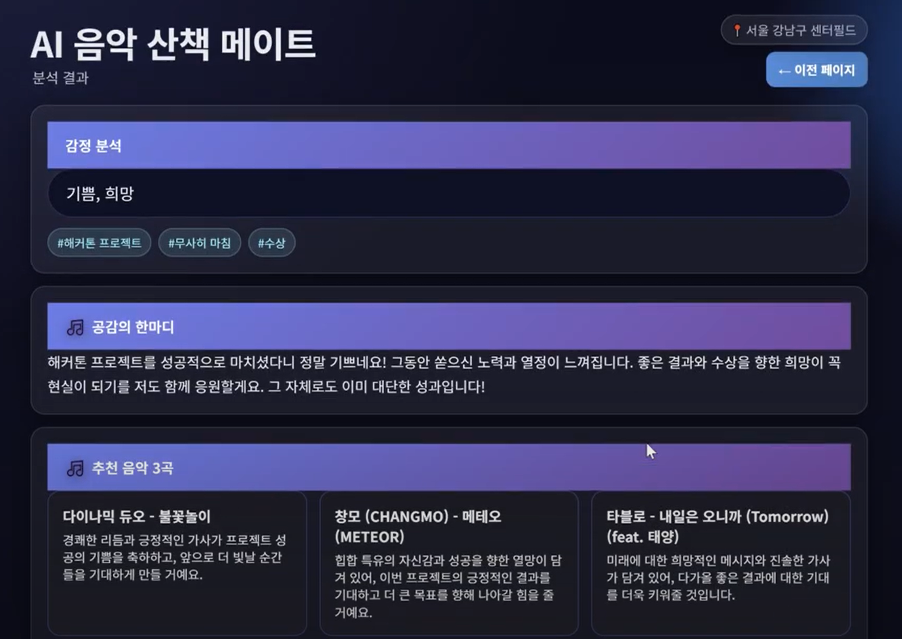
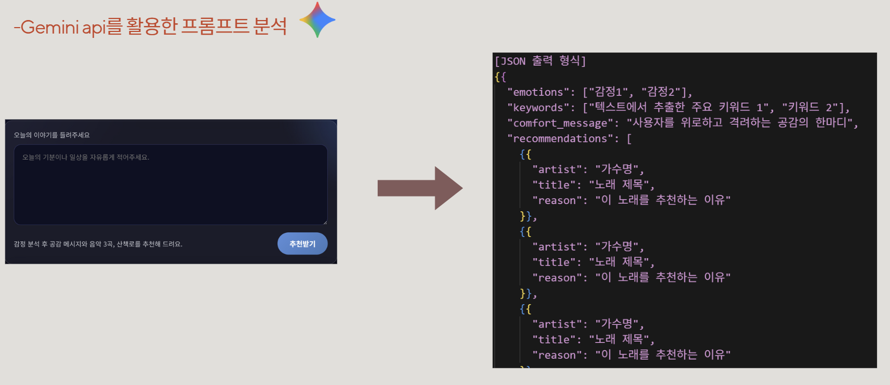
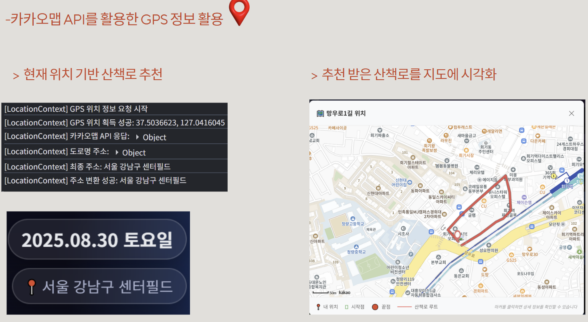

# 감성 분석 기반 개인화 산책로 추천 서비스
 
동대문구 1인 가구를 위한 AI 기반 보행 활성화 프로젝트  

---

## 📖 프로젝트 소개 (Introduction)

**Vibe Street**는 K-HTML 해커톤 **'주제 3: 워킹 시티 동대문'**의 목표인 **보행 활성화와 녹지 이용 증진**을 위해 기획되었습니다.  

저희는 서울시 자치구 중 **1인 가구 비율이 가장 높은(50.19%) 동대문구**의 특성에 주목했습니다.  

1인 가구가 겪는 정서적 고립감과 낮은 신체 활동 문제를 해결하기 위해, 사용자의 감정을 AI로 분석하여 **맞춤형 산책로, 공감의 메시지, 음악**을 추천하는 웹 서비스를 개발했습니다.  

이 프로젝트는 단순한 경로 추천을 넘어, **사용자가 산책을 통해 감성적인 위로와 치유를 경험**하게 하는 것을 목표로 합니다.  

---
**구현 영상**
이미지를 클릭하면 구현 영상 페이지로 이동합니다.

*(이미지를 클릭하면 YouTube에서 전체 영상을 시청할 수 있습니다.)*

---

## ✨ 주요 기능 (Core Features)

- **AI 감성 분석**  
  사용자가 입력한 일상 텍스트를 **Gemini API**가 분석하여 핵심 감정과 키워드를 추출하고, 사용자를 위한 따뜻한 공감 메시지를 생성합니다.

- **맞춤형 산책로 및 음악 추천**  
  분석된 감정과 자체 구축한 **'감성 점수 DB'**를 매칭하여, 현재 사용자의 감정에 가장 적합한 산책로와 음악 3곡을 추천합니다.

- **위치 기반 시각화**  
  **카카오맵 API**를 활용하여 사용자의 현재 위치를 기반으로 추천된 산책로의 경로를 지도 위에 시각화하여 보여줍니다.

- **리워드 시스템**  
  사용자의 실제 산책을 독려하기 위해, 추천받은 산책로 주변 지역 상권(카페, 식당)의 할인 쿠폰을 제공합니다.

- **산책로 커뮤니티**  
  그날 같은 산책로를 추천받은 사용자들끼리 **익명으로 소통할 수 있는 커뮤니티 채팅 기능**을 제공하여 느슨한 유대감을 형성합니다.

---

## 🛠️ 서비스 파이프라인 (Pipeline)

1. **[사용자]**  
   그날의 기분이나 일상을 자유롭게 텍스트로 입력합니다.

2. **[AI 분석]**  
   Gemini API가 텍스트를 분석하여 감정, 키워드, 공감 메시지, 추천 음악이 포함된 JSON 데이터를 반환합니다.

3. **[산책로 매칭]**  
   분석된 감정과 **자체 '감성 점수 DB'**를 비교하여 사용자에게 가장 적합한 산책로를 선정합니다.

4. **[결과 제공]**  
   추천 산책로, 공감 메시지, 음악, 커뮤니티, 주변 상권 쿠폰 정보를 사용자에게 제공합니다.

---

## 💻 기술 스택 (Tech Stack)

- **AI: Google Gemini**  
  → 뛰어난 문맥 이해력을 바탕으로 복합적인 감정을 정확하게 분석하고, JSON 출력 형식을 통해 개발 효율을 극대화했습니다.

- **Backend: Flask**  
  → Python 기반의 경량 프레임워크로 신속한 서버 구축이 가능하며, AI 라이브러리와의 호환성이 뛰어납니다.

- **Frontend: React**  
  → 컴포넌트 기반의 UI 개발 방식으로 높은 생산성과 효율적인 유지보수가 가능합니다.

- **Database: Firebase**  
  → Gemini API를 통해 받은 JSON 형식의 답변을 다루기 용이하며, 로그인 및 회원가입 기능 구현에 편리합니다.

- **API: Kakao Maps API**  
  → 사용자의 현재 위치(GPS) 정보를 기반으로 추천 산책로를 지도에 정확히 시각화하기 위해 사용했습니다.

---

## 🏞️ 구현 화면 (Screenshots)

(이곳에 프로젝트의 주요 화면 스크린샷을 추가하세요.)

1. **감정 입력 및 분석 화면**  
   

   

2. **카카오맵 연동 화면**  
    

   

3. **커뮤니티 및 리워드 화면**  
   
